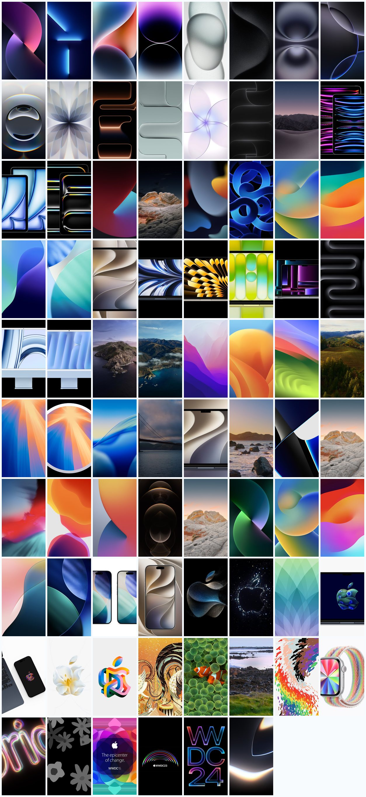

# iPhone 13 – 18 官方跟机壁纸（原图）

Apple 官方随机器型壁纸合集，从 **iPhone 13（2021）到 iPhone 18 Pro / iPhone Duo（2026）**，
全部为**原始分辨率未压缩原件**，非截图、非二次加工。

**共 151 个文件 / 约 352 MB / 15 个机型目录**

## 在线浏览

🌐 <https://leon7786.github.io/20260923-iphone-wallpapers/> — 按世代筛选、搜索颜色、点击预览，单张原图直接下载。

## 目录

| 文件夹 | 机型 | 年份 | 内容 | 文件数 | 分辨率 |
|---|---|---|---|---|---|
| `01-iPhone-13` | iPhone 13 / 13 mini | 2021 | Twist 5 色 × 浅/深 | 20 | 1404×3040 |
| `02-iPhone-13-Pro` | iPhone 13 Pro / Pro Max | 2021 | Light Beams 4 色 × 浅/深 | 16 | 1542×3334 |
| `03-iPhone-14` | iPhone 14 / 14 Plus | 2022 | 5 色 | 5 | 1290×2796 |
| `04-iPhone-14-Pro` | iPhone 14 Pro / Pro Max | 2022 | 4 色 | 4 | 1290×2796 |
| `05-iPhone-15` | iPhone 15 / 15 Plus | 2023 | 5 色 | 5 | 1290×2796 |
| `06-iPhone-15-Pro` | iPhone 15 Pro / Pro Max | 2023 | 4 色 × 锁屏/主屏/息屏 | 40 | 1290×2796 |
| `07-iPhone-16` | iPhone 16 / 16 Plus | 2024 | 5 色 | 5 | 1290×2796 |
| `08-iPhone-16-Pro` | iPhone 16 Pro / Pro Max | 2024 | 4 色 | 4 | 1320×2868 |
| `09-iPhone-16e` | iPhone 16e | 2025 | 1 款 | 1 | 1179×2556 |
| `10-iPhone-17` | iPhone 17 | 2025 | 5 色 × 锁屏/主屏 | 10 | 1206×2622 |
| `11-iPhone-17-Pro` | iPhone 17 Pro / Pro Max | 2025 | 3 色 × 锁屏/主屏 | 6 | 1320×2868 |
| `12-iPhone-Air` | iPhone Air | 2025 | 4 色 × 锁屏/主屏 | 8 | 1260×2736 |
| `13-iPhone-17e` | iPhone 17e | 2026 | 3 色 | 3 | 1170×2532 |
| `14-iPhone-18-Pro` | iPhone 18 Pro / Pro Max | 2026 | Vitra 4 色 × 锁屏/主屏 | 8 | 1320×2868 |
| `15-iPhone-Duo` | iPhone Duo（折叠） | 2026 | 内/外屏 × 锁屏/主屏 × 浅/深 | 16 | 2853×2007 / 1398×2034 |

完整清单（含每个文件的尺寸、格式、体积）见 [`report.json`](report.json)。

## 一键下载

全部文件的打包 ZIP 在 [Releases](../../releases) 里（`iPhone-stock-wallpapers-13to18.zip`，约 349 MB）。

## 说明

- **原图**：均为官方素材的最大尺寸。多数大于屏幕逻辑分辨率，因为 Apple 的原生壁纸素材本身留了视差余量
  （例：iPhone 13 为 1404×3040，iPhone 13 Pro 为 1542×3334）。
- **格式**：`.jpg` 任何设备直接用；`.heic` 是 Apple 原生格式（iOS / macOS 设为壁纸画质更好、体积更小），
  13 系列、15 Pro、Duo 提供 heic，Duo 另附最高画质 `.png`。
- **锁屏 / 主屏**：Pro 机型官方素材区分 Lock Screen 与 Home Screen（无时钟、无小组件的干净版本）。
- **浅色 / 深色**：13 系列与 Duo 区分 Light / Dark。
- **2026 年阵容**：Apple 2026 年 9 月只发布了 iPhone 18 Pro / 18 Pro Max 与首款折叠机 iPhone Duo，
  没有标准版 iPhone 18，因此 18 代收录 Pro 与 Duo。

## 数据来源

原尺寸素材来自 iClarified 从 Apple 官方素材 / iOS 固件中提取的整理包：

- iPhone 13 系列（iOS 15）：<https://www.iclarified.com/84267/>
- iPhone 14 系列：<https://www.iclarified.com/87374/>
- iPhone 15 系列：<https://www.iclarified.com/91483/>
- iPhone 16 系列：<https://www.iclarified.com/94911/>
- iPhone 16e：<https://www.iclarified.com/96469/>
- iPhone 17 / 17 Pro：<https://www.iclarified.com/98545/>
- iPhone Air：<https://www.iclarified.com/98546/>
- iPhone 17e：<https://www.iclarified.com/100084/>
- iPhone 18 Pro：<https://www.iclarified.com/102105/>
- iPhone Duo：<https://www.iclarified.com/102102/>

壁纸版权归 Apple Inc. 所有，此处仅作归档与个人使用。
